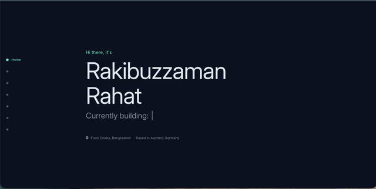

# Rakibuzzaman Rahat - Personal Site (v2)

**Version 2** of [rzaman.site](https://rzaman.site): a single-page Jekyll portfolio with hero, about, projects, games, experience, blog, and contact. Design inspired by [Azmain Adel](https://azmainadel.com/) and [Brittany Chiang (v4)](https://v4.brittanychiang.com/).



---

## Build and serve

```bash
# Install dependencies (once)
bundle install

# Build the static site (output in _site/)
bundle exec jekyll build

# Serve locally at http://localhost:4000 (rebuilds on file changes)
bundle exec jekyll serve
```

**Deploy:** Push to `master`; GitHub Actions builds and deploys to GitHub Pages. Custom domain is set via `CNAME` (rzaman.site).

---

## How to update content

### 1. “Currently building” (hero typing line)

The rotating line under your name (“Currently building: …”) comes from **`_config.yml`**:

```yaml
typing_projects:
  - "AI & Automation @ Uniper"
  - "Indie games @ ZeezBit"
  - "Boighorlibrary.com"
```

- Add or remove lines to change the phrases.
- Order is the rotation order.

---

### 2. Featured projects and project list

- **Location:** One file per project in **`_projects/`** (e.g. `_projects/my-project.md`).
- **Front matter** (at the top of each file) controls how it appears:

```yaml
---
name: Project Name
subtitle: Optional one-liner
tools: [Tool A, Tool B]
image: /assets/img/project-image.png
description: Short description for cards/lists
featured: true          # true = show in “Featured” on homepage (up to 3)
year: 2022
github: https://github.com/you/repo
external_url: https://...  # optional; use if project lives elsewhere
---
```

- **Featured:** Up to 3 projects with `featured: true` appear in the main “What I’ve Built” section. The rest appear under “Other Noteworthy Projects” and on the Projects page.
- **Images:** Put images in **`assets/img/`** and reference as above.
- **New project:** Create `_projects/your-slug.md` with the same front matter and write the body in Markdown. The slug becomes the URL (e.g. `/projects/your-slug`).

---

### 3. Blog (writing)

- **Location:** **`_posts/`**. One file per post.
- **Filename:** `YYYY-MM-DD-slug.md` (e.g. `2025-02-06-my-post.md`).
- **Front matter:**

```yaml
---
layout: post
title: Your Post Title
date: 2025-02-06 12:00:00
# optional: tags, categories
---
```

- **Featured posts on homepage:** The first 3 posts (newest first) are shown under “Featured Posts” on the landing page. Order is by `date`.
- Full blog index: `/blog/`. Tags: `/blog/tags.html`.

---

### 4. Experience (work and other)

- **Professional experience:** **`_data/pro-experience-data.yml`**
- **Other experience (e.g. side projects, volunteering):** **`_data/other-experience-data.yml`**

Each entry looks like:

```yaml
- place: <a href="https://..." target="_blank">Company Name</a>
  logo: "../assets/img/logo.png"
  position: Job Title
  from: Month YYYY
  to: Present   # or Month YYYY
  description: |
    Short description. Can be multiple lines.
```

- **Logo:** Path is relative to the site root; put images in **`assets/img/`**.
- Comment out an entry with `#` to hide it without deleting.

---

### 5. Games (itch.io / ZeezBit)

- **Location:** **`_data/games.yml`**
- Add entries to show game cards on the homepage (up to 3). If the list is empty, a single “ZeezBit Studios” card linking to itch.io is shown.

```yaml
- name: "Game Title"
  url: "https://zeezbitstudios.itch.io/your-game"
  image: "game-screenshot.png"   # in assets/img/
  description: "Short description"
```

---

### 6. About (life story)

- **Single source:** **`_includes/about_prose.html`**
- Used on both the homepage About section and the `/about/` page. Edit this file only; both places update.

---

### 7. Site-wide settings and links

- **`_config.yml`**
  - `title`, `description`, `url`
  - **Author / social:** Under `author:` (e.g. `linkedin`, `github`, `twitter`, `bluesky`, `cal`, `itchio`). Uncomment and set usernames to show links in the contact section.
- **Contact links:** Same `author` keys; they’re matched with **`_data/social-media.yml`** for base URLs and icons. Add or edit entries in `social-media.yml` for new services.

---

### 8. Inspiration and footer

- **Footer “Inspiration” links:** Edit **`_includes/footer.html`** (links to Azmain Adel and Brittany Chiang).
- **Design inspiration meta:** **`_includes/head.html`** has a `design-inspiration` meta tag; change there if you update attribution.

---

## Recording a scrolling GIF for the README

1. **Serve the site locally:** `bundle exec jekyll serve` and open http://localhost:4000.
2. **Record the screen** while you slowly scroll down the page (hero → about → projects → games → experience → blog → contact).
3. **Export as GIF:**
   - **macOS:** [Kap](https://getkap.co/) - select region, record, export as GIF.
   - **Windows:** [ScreenToGif](https://www.screentogif.com/) - record, then export as GIF.
   - **Browser:** Use an extension that can record the visible tab and export GIF (e.g. “GIF Recorder” or similar).
4. **Save as** **`assets/img/site-preview.gif`** in this repo so it appears at the top of the README.

**From a video (e.g. `.mov`) instead of a GIF tool:** If you have [ffmpeg](https://ffmpeg.org/) installed, you can convert a screen recording:

```bash
ffmpeg -i screen_recording.mov -vf "fps=8,scale=640:-1:flags=lanczos,palettegen" -y assets/img/palette.png
ffmpeg -i screen_recording.mov -i assets/img/palette.png -lavfi "fps=8,scale=640:-1:flags=lanczos[x];[x][1:v]paletteuse" -y assets/img/site-preview.gif
rm assets/img/palette.png
```

---

## Repo structure (quick reference)

| Path | Purpose |
|------|--------|
| `_config.yml` | Site title, URL, author, typing phrases, plugins |
| `_includes/landing.html` | Homepage sections (hero, about, projects, games, experience, blog, contact) |
| `_includes/about_prose.html` | About / life story text (used on homepage and /about/) |
| `_projects/*.md` | Project pages and featured project data |
| `_posts/*.md` | Blog posts; first 3 appear as “Featured Posts” |
| `_data/pro-experience-data.yml` | Professional experience |
| `_data/other-experience-data.yml` | Other experience |
| `_data/games.yml` | Games shown on homepage |
| `_data/social-media.yml` | Base URLs and icons for contact links |
| `pages/*.md`, `pages/*.html` | Standalone pages (about, blog, experience, etc.) |
| `assets/img/` | Images (avatar, logos, project screenshots, preview GIF) |

---

## Branches

- **`master`** - current site (v2); GitHub Pages deploys from here.
- **`previous`** - archive of the pre-revamp site (v1).
