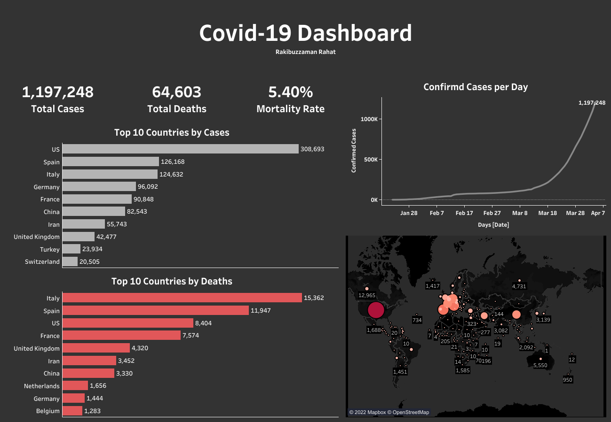
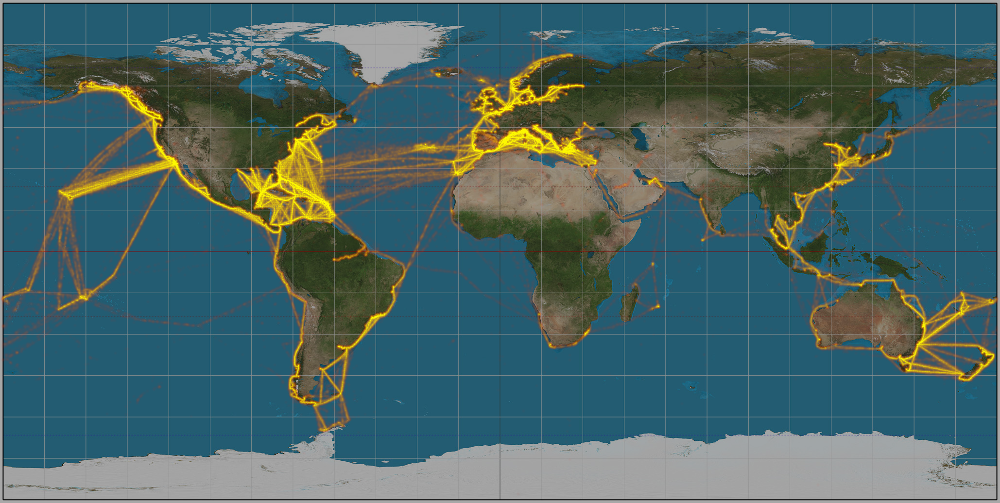

# Covid-19 Data Analysis 

This a data visualisation project on Covid-19 dataset. This data contains the total confirmed cases and deaths as of **4th April, 2020** worldwide. You can download the dataset [here](https://docs.google.com/spreadsheets/d/1wt3I4--yBMrcQfR_VKAmAvEnW2dyF6h9VE_EXtNEFs4/edit#gid=1638746837).

Before jumping on the analysis, a few decisions were taken and these are:
- Availability of the data.
- Visualisation tool(s).
- End goal of the project.

Regarding **availability** of the data, many forms of Covid-19 data is available on the internet. I have used the [data](https://docs.google.com/spreadsheets/d/1wt3I4--yBMrcQfR_VKAmAvEnW2dyF6h9VE_EXtNEFs4/edit#gid=1638746837) mentioned above. 

The **visualisation tool** I have used here is [Tableau Public](https://public.tableau.com/en-us/s/). Tableau is one of the foremost visualisation tools used in the industry. It provides real time data analysis from one or more sources. It can cater for big datasets.

The **end goal** of the project is to build a dashboard that is in sync with updated data in real time.

### Exploratory Data Analysis

The data is exported as a csv file instead of directly linking the google sheet. The two sheets inside the xlsx file *confirmed cases* and *deaths* were combined inside Tableau. There were a few feature columns that was omitted (FIPS-only used for USA, table names).

Three new features were generated using the Tableau **Calculated field** option. These are:
1. Total confirmed cases (#)
2. Total deaths (#)
3. Mortality rates (%)

 

 

> While filtering by **Country**, there was an attribute namely *Curise ship*. It indicates the number of people that were comfirmed cases (734) and had died (14) on a cruise ship. To indicate that on the world map I have used the location near the **Caribbean Islands** to mark the most used cruise ship routes.

 

 

After that I have used the data and features to build the dashboard. You can view the ineractive dashboard right [here](https://public.tableau.com/app/profile/rakibuzzaman.rahat6846/viz/Covid-19dataanalysis_16497710596810/Dashboard1). Please feel free to provide feedbacks. For more visualisation visit this [link](https://public.tableau.com/app/profile/rakibuzzaman.rahat6846).